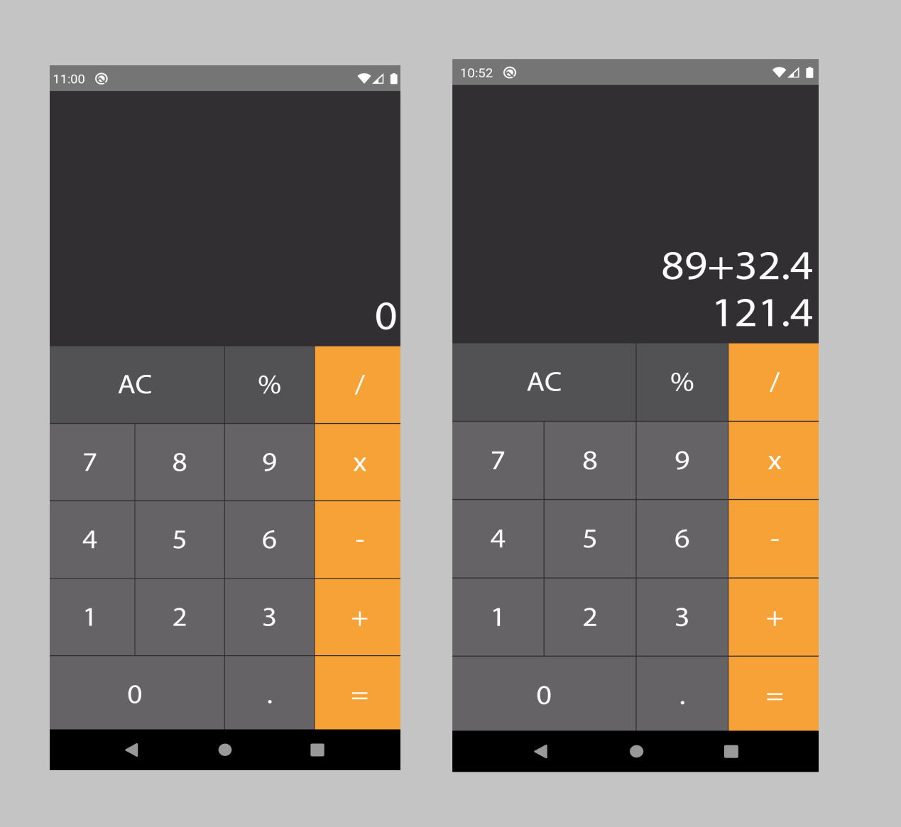

<h1 align="center">
  Calculadora
</h1>

<h4 align="center">Calculadora desenvolvida em React Native</h4>

## :rocket: Como executar

<ul>
  <li>Clonar o projeto e no diretório raiz executar o comando yarn pra instalar as dependências do projeto</li>
  <li>Na pasta raiz executar yarn start</li>
  <li>Em outra janela do terminal, também na pasta raiz executar yarn android ou yarn ios</li>
</ul>

## :speech_balloon: Funcionalidades

<ul>
  <li>Calculos, números decimais, porcentagem</li>
</ul>

## ⌨️ Tecnologias

<ul>
  <li>React Native</li>
  <li>TypeScript</li>
  <li>Styled Components</li>
</ul>

